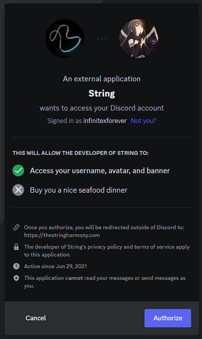
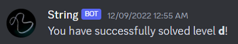
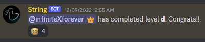
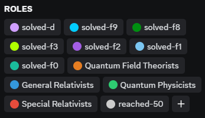

# String - The Discord bot for online riddles

**String** is a Discord bot (with a web API) for online riddles that

- **automatically** saves players' solving progress
- **automatically** unlocks Discord channels/roles for players
- provides extra features such as achievements

It is created by Kobe Li (infiniteXforever),
the creator of the online riddle [The String Harmony](https://thestringharmony.com/).

## For players

String is very easy to use:

- First login using your Discord account by visiting `/login/index.htm`



- When you solve a level or find an achievement on the website,
you will get messages and new roles/channel access on Discord **automatically**







- The bot has some commands for you to use:

1. `!stat`: Show player statistics
2. `!recall [level]`: Show links and username/password of the levels you reached/solved
3. `!color [level]`: Change your username color according to solved optional levels
4. `!reach [path]`: Register the solution pages you reached, when the automatic features don't work

## For creators

Feel free to use this public version of String to build the bot for your riddles!
Here are the steps to follow:

1. Create a new application in [Discord Developer](https://discord.com/developers).
2. In `Bot`, set the username and icon, and enable all options under `Privileged Gateway Intents`.
Create a `Token` and save it.
3. In `OAuth2->URL Generator`, select `bot->Administrator`.
Use the created link to add your bot into your server.
4. Edit `bot_auto.py`. Follow the `#` instructions and insert information.
5. Edit the txt files: `achievements, levels, milestones, secrets, unpw`.
See the example files for references. Note that each field is separated by `Tab`. Format:
   - `achievements.txt`: `[name] [path]`
   - `levels.txt`: `[name] [answer path]` in solving order
     * The answer path also serves as the front path of next level.
   - `milestones.txt`: The first row is the names appeared in `!stat`.
   The remaining rows follow the format `[level name] [milestone name]`.
     * There must be a milestone for the final level.
	 The names in `!stat` must match with the milestones.
   - `secrets.txt`: same as `levels.txt`
   - `unpw.txt`: `[name of level with un/pw as answer] [un/pw]`
     * For example, if the file contains
	 ```
	 02 infinite/forever
	 06 kobe/li
	 ```
	 that means levels `03-06` are locked by `infinite/forever`. Use `None` if there is no un/pw.
6. Put achievement images as JPG in `cheevos`. They must have the same names as in `achievements.txt`.
7. Host the files on a cloud platform.
[Heroku](https://www.heroku.com) is recommended since all the configuration files are included here.
8. Run `bot_auto.py`
9. Upload `login` folder onto your website.
1. Go back to [Discord Developer](https://discord.com/developers).
In `OAuth2->General`, get the client ID and client secret. Enter the login URL in `Redirects`.
2. In `OAuth2->URL Generator`, select `identify` and choose the login URL. Save the OAuth2 link.
3. Edit `login_original.js` with the info you have got by following the `//` instructions.
4. Edit and upload `stringbot_original.js`. Include it on every page you want to trigger the bot.
5. It is recommended to obfuscate the js files.
6. Set up the corresponding channels and roles in Discord.

## To-do list

- Replace txt files with database
- Leaderboard
- Save and check progress for achievements
- Automate initialization and make better interface for creators

## Contact me

Ideas and suggestions are welcome. You can contact me (infiniteXforever) on
[Discord](https://discord.gg/q8pYdR73T8) by joining our online riddle server.